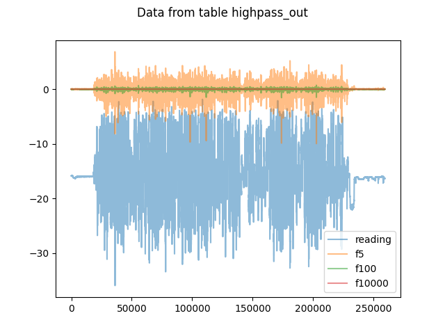
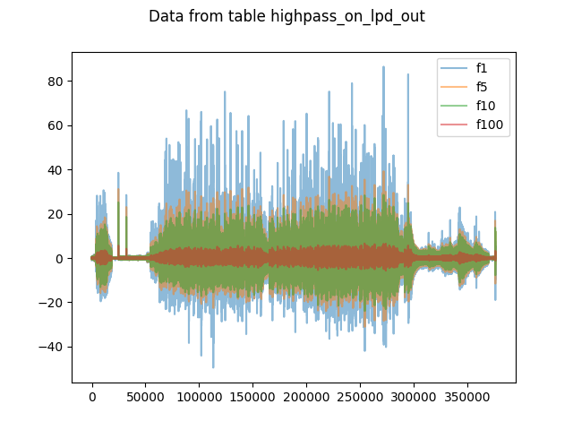
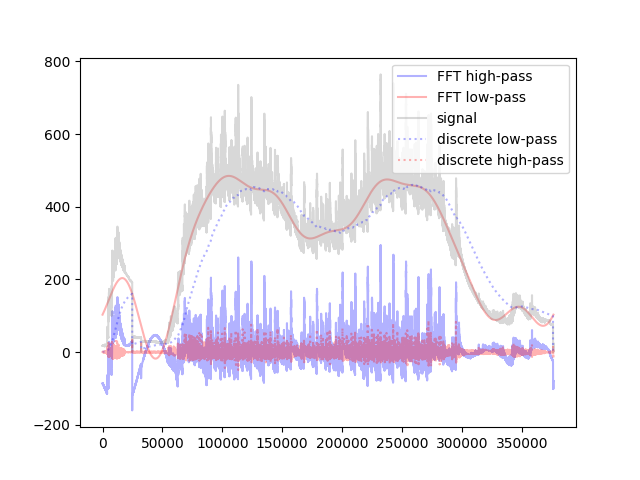

# Table of Contents

1.  [Python Bandpass filters](#org4b48181)
2.  [Installation](#org6806c21)
    1.  [Execute the following scripts from the source directory](#orga217a61)
        1.  [Loading the data into Vertica from the CSV file](#org17e3e15)
    2.  [Loading the libraries](#org51c3bd0)
        1.  [Loading the lowpass library](#org20014ee)
        2.  [Loading the highpass library](#org23719b7)
    3.  [Running the functions](#org39510f2)
        1.  [p_lowpass](#org9632d7d)
        2.  [highpass](#org5135c50)
    4.  [Plotting the result](#org58092cc)
        1.  [Running the highpass filter on the highpass data](#orgb4c7aff)
        2.  [Running the highpass filter on the lowpass data](#org12f0c5c)
4.  [Comparison of these filters to filtering with Fourier Transforms](#orgfd8a3a1)

# Python Bandpass filters

This repository contains Python user-defined functions (UDFs) for
highpass and low-pass filters on time-series data.

A highpass filter takes the time-series data and discards
low-frequency parts of the "signal", passing through the
high-frequency components.  A lowpass filter passes the low-frequency
part of the signal --- including the 0-hz bias (offset of the signal from
0) --- and discards the high-frequency components.  One might use a
lowpass filter to smooth out noise in the data.

The algorithms implemented are drawn from the descriptions of the
discrete-time versions described in Wikipedia: 

-   <https://en.wikipedia.org/wiki/Low-pass_filter>
-   <https://en.wikipedia.org/wiki/High-pass_filter>

# Installation

## Execute the following scripts from the source directory

The following scripts use `pwd` to set the absolute pathname of
`lowpass_data.csv`, `highpass_data.csv`,the `p_lowpass.py` library, and
the `highpass.py` library.  Please execute them in the directory where
those files are located.

### Loading the data into Vertica from the CSV file

(Note: the following SQL scripts presume that your Vertica has
flextables installed.)

For historical reasons we have two data-sets intended for the
different filters &#x2014; `highpass.csv` and `lowpass.csv`.  The
algorithms can be run on either dataset, of course.

    vsql -f lowpass_load.sql
    vsql -f highpass_load.sql

Since these commands use relative pathnames to find components (the
data files and the UDx libraries), they need to be run in the
directory containing `p_lowpass.py` and `highpass.py`.

`lowpass_load.sql` will load the data from `lowpass_data.csv` into a flextable,
`lowpass_data`.  It then derives a standard Vertica table,
`lowpass_data_with_deltas`, which has columns:

-   **row_n:** The row number of the data
-   **tstamp:** The timestamp from the data (`row_n` and `tstamp` may be
    redundant, as they have the same ordering).
-   **dt:** the "delta" of this row's timestamp from the previous row's
    timestamp.  Used as the "delta-t" in the discrete low- and
    highpass filter algorithms.
-   **reading:** the sensor reading for this time
-   **dreading:** the "delta" of this reading from the previous row's
    reading.  Used as the "delta-signal" in the discrete
    low- and highpass filter algorithms.

`highpass_load.sql` does the same thing for the highpass data in
`highpass.csv` creating `highpass_data_with_deltas` with the same
columns.

These scripts begin by cleaning up from previous executions ---
subsequent runs replace the output of previous runs.

## Loading the libraries

The libraries are loaded by the first few lines of `lowpass_load.sql`
and `highpass_load.sql`.  These two SQL scripts must be run in the
directory containing `p_lowpass.py` and `highpass.py`.

### Loading the lowpass library

We inform Vertica about the file to load the library from by giving it
an absolute pathname to the library, then informing Vertica how to
find the function-factory within the library.

These commands appear at the beginning of the `lowpass_load.sql` script:

    \set library lowpasslib
    \set libfile ''''`pwd`'/p_lowpass.py'''
    
    DROP LIBRARY IF EXISTS :library CASCADE;
    CREATE LIBRARY :library AS :libfile LANGUAGE 'Python';
    CREATE FUNCTION lowpass 
        AS LANGUAGE 'Python' NAME 'p_lowpass_factory' 
        LIBRARY :library fenced;

The first two lines define some symbols used in the subsequent lines. 

`DROP LIBRARY IF EXISTS :library CASCADE;` is there to clean up any
earlier version of the library that may be present.

`CREATE LIBRARY :library AS :libfile LANGUAGE 'Python';` informs
Vertica where on the filesystem to find the text of the library, and
what name (`lowpasslib`) will be used to refer to it.

`CREATE FUNCTION lowpass ...` tells Vertica what "function" (it's
actually a class with methods for setup, invocation, and tear down the
functionality) to find in the library and how to query the library to
find out the interface the function provides.

### Loading the highpass library

The commands for loading the highpass library are similar to those
used to load the lowpass library and are found in
`highpass_load.sql`.

    \set library highpasslib
    \set libfile ''''`pwd`'/highpass.py'''
    
    DROP LIBRARY IF EXISTS :library CASCADE;
    CREATE LIBRARY :library AS :libfile LANGUAGE 'Python';
    CREATE FUNCTION highpass
        AS LANGUAGE 'Python' NAME 'highpass_factory'
        LIBRARY :library fenced;

See the explanation for loading the lowpass library for an explanation
of what these lines do.

## Running the functions

There are two files, `highpass_run.sql` and `lowpass_run.sql` which
can be used to run the libraries on the data-sets provided.

### p_lowpass

`lowpass_run.sql` runs the lowpass algorithm across several sets of
parameters for frequency and for "alpha".  The alpha parameter is
meaningful in the context of the viewing the lowpass filter as an RC
circuit (alpha = RC/(RC + delta_t)).

The interface for the lowpass function is:

    p_lowpass(
        <float-delta-time>, 
        <float-sensor-reading> 
        USING PARAMETERS "frequency" = <float-frequency-in-hz>
    ) ORDER BY timestamp;
    --- or
    p_lowpass(
        <float-delta-time>, 
        <float-sensor-reading> 
        USING PARAMETERS "alpha" = <float-alpha>
    ) ORDER BY timestamp;

Where:

-   **float-delta-time:** the time-interval between this sensor
    reading and the previous one in seconds (e.g., 0.01)
-   **float-sensor-reading:** the sensor reading in whatever units
    you're measuring
-   **float-frequency-in-hz:** the cutoff frequency for the filter in
    hertz
-   **float-alpha:** 0 < alpha < 1

The function returns a single column float value for each row
representing the output of the lowpass filter at that point, that is,
the value of the sensor-reading without the high-frequency noise.

**alpha** can be defined in terms of frequency, **f** and **delta_T**:

alpha = delta_T / (RC + delta_T)

alpha = 2\*pi\*delta_T\*f/((2\*pi\*delta_T\*f) + 1)

Similarly, **f** can ge defined in terms of **alpha** and **delta_T**:

f = alpha/((1-alpha)\*2\*pi\*delta_T)

The script `lowpass_run.sql` runs the function on the
`lowpass_data_with_deltas` table created by `lowpass_load.sql`
producing a table, `lowpass_out`, with columns:

-   **row_n:** the row-number from `lowpass_data_with_deltas`
-   **tstamp:** the timestamp from `lowpass_data_with_deltas`
-   **reading:** the sensor reading from `lowpass_data_with_deltas`
-   **dt:** the "delta-t", i.e., the change in timestamp from the
    previous row
-   **f001:** output of lowpass with frequency 0.001 hz
-   **f0016:** output of lowpass with frequency 0.0016 hz
-   **f002:** output of lowpass with frequency 0.002 hz
-   **f01:** output of lowpass with frequency 0.01 hz
-   **f1:**  output of lowpass with frequency 1 hz
-   **f5:**  output of lowpass with frequency 5 hz
-   several columns using different values of alpha

### highpass

`highpass_run.sql` runs the highpass algorithm on the
`highpass_data_with_deltas` table created by `highpass_load.sql`,
\*using different cutoff frequencies.

The interface for the highpass function is:

    highpass(<float-frequency>, <float-delta-time>, <float-sensor-reading>) 
    ORDER BY timestamp;

Where:

-   **float-frequency:** the cutoff frequency in hertz
-   **float-delta-time:** the time-interval between this sensor reading
    and the previous one, in seconds, e.g., 0.01.
-   **float-sensor-reading:** the sensor reading in whatever units
    you're measuring.

The function returns a single column float value for each row
representing the output of the highpass filter at that point, that is,
the value of the sensor-reading without the low-frequency component of
the time-series signal.

The script `highpass_run.sql` runs the function on the
`highpass_data_with_deltas` table created by `highpass_load.sql`
producing a table, `highpass_out`, with columns:

-   **row_n:** the row-number from `highpass_data_with_deltas`
-   **tstamp:** the timestamp from `highpass_data_with_deltas`
-   **reading:** the sensor reading from `highpass_data_with_deltas`
-   **dt:** the "delta-t", i.e., the change in timestamp from the
    previous row
-   **f5:**  output of highpass with frequency 5 hz
-   **f10:**  output of highpass with frequency 10 hz
-   **f100:**  output of highpass with frequency 100 hz
-   **f1000:**  output of highpass with frequency 1000hz
-   **f10000:**  output of highpass with frequency 10000 hz

## Plotting the result

As a sanity check, this repository includes several programs for
plotting data output by these functions.

`plot_parallel.py` uses the `vertica_python` python module to read the
data from Vertica tables created by `highpass_run.sql` and
`lowpass_run.sql`.

It takes as arguments a list of column names and a table name, e.g., 

    python3 plot_parallel.py reading f001 f0016 f002 f01 f1 f5 lowpass_out

The "fnnn" column names are derived from 0.001, 0.0016, 0.002, 0.01,
.1 and .5 hertz.  On these plots, a 1 hertz signal would be 100 ticks
wide on the **x**-axis. 

Will create (separate) plots of the `reading`, `f001`, `f0016`,
`f002`, `f01`, `f1`, and  `f5` columns of the `lowpass_out` table
created by `lowpass_run.sql`.

It puts its output into a PNG file with a name constructed from the
table and column names (overwriting any file that was there before),
as well as running an interactive display which can be manipulated.
Note that the vertical scales on the several plots may differ.

Here is an example of the output:

(X-axis measures "ticks" in the data-set &#x2014; ticks are uniformly
happening at 0.01 second in the lowpass dataset.)

Stacking the plots as `plot_parallel.py` does is useful when comparing
things with radically different ranges in the vertical axis (which is
why the vertical axes may differ).  For things like the lowpass
output, which cover the same range in the vertical axis, you can also
use `plot_overlay.py` to look at multiple columns on one plot:

    python3 plot_overlay.py reading f001 f002 f01 lowpass_out

The results are seen here:

This plot shows a problem with this implementation of a low-pass
filter: namely, as the critical frequency decreases the system has
more "inertia" responding to changes in the signal more slowly.  The
curve gets smoother, but part of that smoothness comes at a cost in
delay of the signal representing the data.

### Running the highpass filter on the highpass data

The script `highpass_run.sql` runs the highpass filter on the highpass
dataset loaded by `highpass_load.sql`.

Plotted with 

    python3 plot_overlay.py reading f5 f100 f10000 highpass_out

(which ignores some of the columns) produces the following results:

### Running the highpass filter on the lowpass data

In order to produce a plot comparing the discrete highpass and
lowpass filters to the output of using Fouriet Transforms to do the
filtering, one needs to run the highpass filter on the lowpass data.
There's no included script for this, but the Vertica SQL commands to
do this are pretty simple.

The first argument in the `highpass` UDF is frequency in hertz.  In
this data-set, a one-hertz signal takes 100 units on the **x** axis.

    DROP TABLE IF EXISTS highpass_on_lpd_out CASCADE;
    CREATE TABLE highpass_on_lpd_out AS
    SELECT lowpass_data_with_deltas.row_n,
           reading,
           highpass(1, dt, reading) as f1,
           highpass(5, dt, reading) as f5,
           highpass(10, dt, reading) as f10,
           highpass(100, dt, reading) as f100
    FROM lowpass_data_with_deltas ORDER BY row_n; 

With the results shown here:

Surprise!  The highpass signal is down around 0!  It doesn't follow
the offset of the signal.  Why?  The offset is **low-frequency data**
that gets filtered out.

If we set aside the raw input (i.e., don't plot the `reading` column
with its distortion of the vertical scale), we can see more detail in
the highpass output: 

# Comparison of these filters to filtering with Fourier Transforms

Partly because of annoyance at the squiggles that remain in the
lowpass filter output, I decided to compare these functions to
filtering with Fourier transforms.  Basically, take Fourier Transform
of the signal, lop off the frequencies you're not interested in, then
take the inverse-Fourier Transform to see the filtered signal.

The file `fft.py` uses the `numpy.fft` module to take the Fast Fourier
Transform (FFT) of the entire dataset, then plots the result in
comparison to some of the results of the lowpass and highpass discrete
filters.

The following plot shows a comparison between filtering-via FFT and
filtering via discrete filters:

The FFT software used reads the entire contents of the array into
memory, so it is limited in the size of the table it processes.

